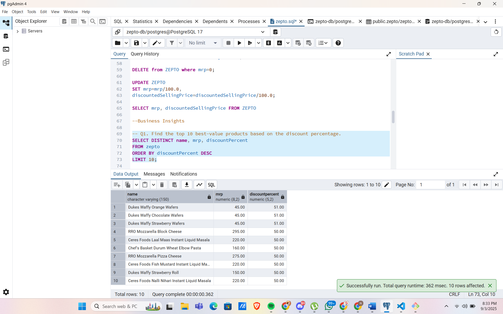

# Zepto Inventory Analysis

## 1. Introduction
This project provides a comprehensive analysis of the Zepto(one of the most popular quick commerce application in India) inventory dataset to derive key business insights. This analysis aims to calculate the revenue in each product category, discount percentage applied to each product category, and the way in which products are categorised.

## 2.Data Source
The data for this project was obtained from https://www.kaggle.com/datasets/palvinder2006/zepto-inventory-dataset/data?select=zepto_v2.csv. The dataset contains 3732 rows and 9 columns including Category, name, mrp, discountPercent,availableQuantity, discountedSellingPrice, weightInGms, outOfStock, quantity.

## 3.Data Cleaning and Transformation
The raw data underwent several crucial cleaning and transformation steps to ensure accuracy, consistency, and suitability for analysis. This included:

**Column Addition:** An additional column has been added by the name of *SKU_ID* to uniquely identify each product.

**Handling Zero Values:** Rows where *mrp* is 0 has been removed.

**Currency Conversion:** To enable proper analysis, the currency of *mrp* column has been converted to rupees from paisa.

## 4.Analysis and Methodology
This project was carried out entirely in PostgreSQL. The methodology followed a structured approach of data cleaning, transformation, and analysis using SQL queries to derive meaningful business insights.

## 5.Business Insights

**Q1. Find the top 10 best-value products based on the discount percentage.**
SELECT DISTINCT name, mrp, discountPercent
FROM ZEPTO
ORDER BY discountPercent DESC
LIMIT 10;

**Q2.What are the Products with High MRP but Out of Stock**
SELECT DISTINCT name,mrp
FROM ZEPTO
WHERE outOfStock = TRUE and mrp > 300
ORDER BY mrp DESC;

**Q3.Calculate Estimated Revenue for each category**
SELECT category,
SUM(discountedSellingPrice * availableQuantity) AS total_revenue
FROM ZEPTO
GROUP BY category
ORDER BY total_revenue;

**Q4. Find all products where MRP is greater than ₹500 and discount is less than 10%.**
SELECT DISTINCT name, mrp, discountPercent
FROM ZEPTO
WHERE mrp > 500 AND discountPercent < 10
ORDER BY mrp DESC, discountPercent DESC;

**Q5. Identify the top 5 categories offering the highest average discount percentage.**
SELECT category,
ROUND(AVG(discountPercent),2) AS avg_discount
FROM ZEPTO
GROUP BY category
ORDER BY avg_discount DESC
LIMIT 5;

**Q6. Find the price per gram for products above 100g and sort by best value.**
SELECT DISTINCT name, weightInGms, discountedSellingPrice,
ROUND(discountedSellingPrice/weightInGms,2) AS price_per_gram
FROM ZEPTO
WHERE weightInGms >= 100
ORDER BY price_per_gram;

**Q7.Group the products into categories like Low, Medium, Bulk.**
SELECT DISTINCT name, weightInGms,
CASE WHEN weightInGms < 1000 THEN 'Low'
	WHEN weightInGms < 5000 THEN 'Medium'
	ELSE 'Bulk'
	END AS weight_category
FROM ZEPTO;

**Q8.What is the Total Inventory Weight Per Category** 
SELECT category,
SUM(weightInGms * availableQuantity) AS total_weight
FROM ZEPTO
GROUP BY category
ORDER BY total_weight;

